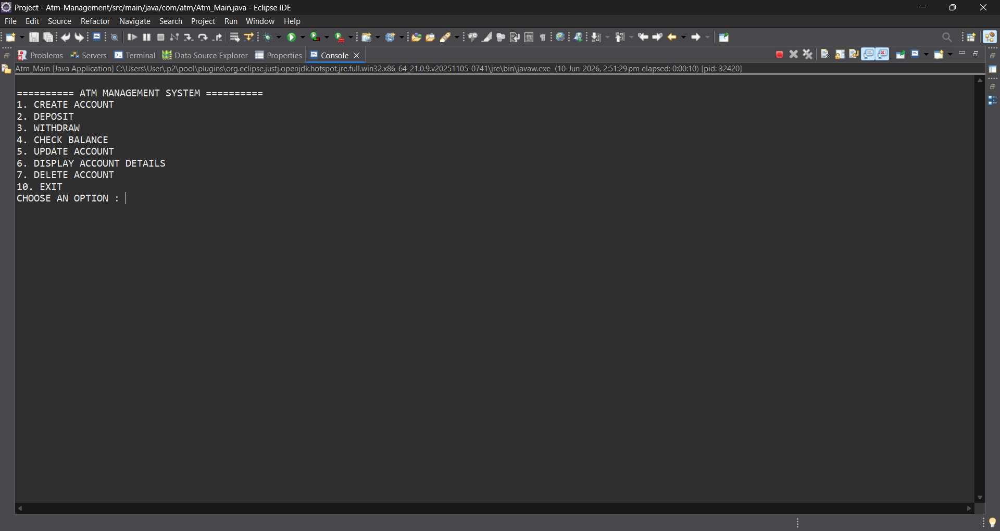
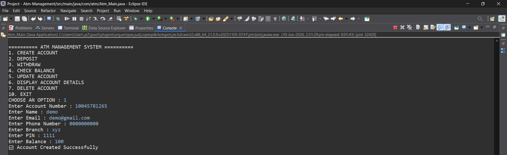
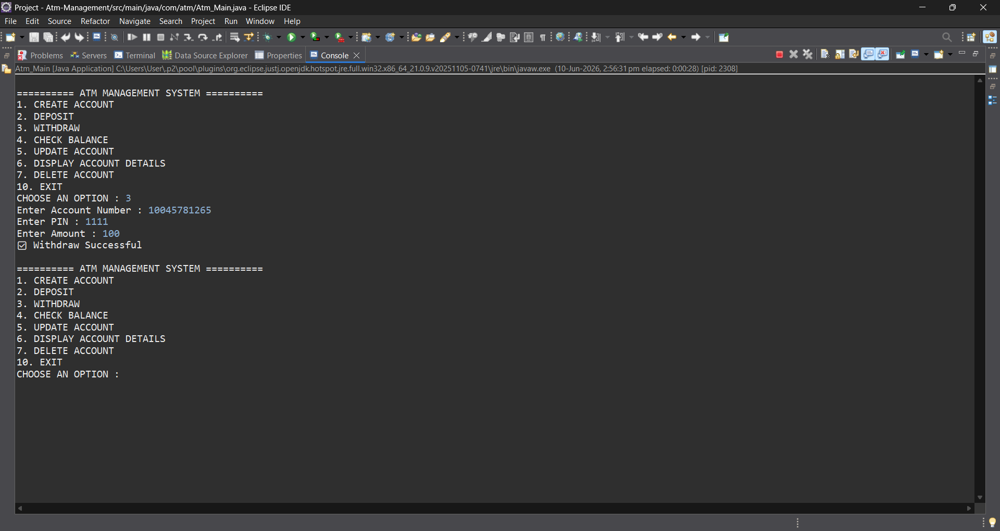
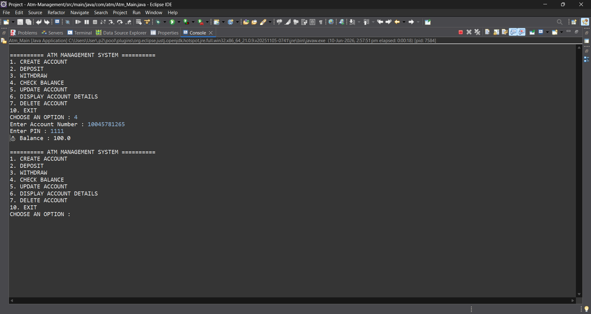
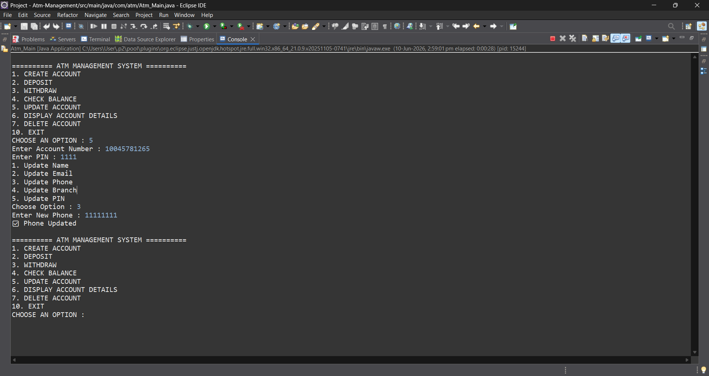
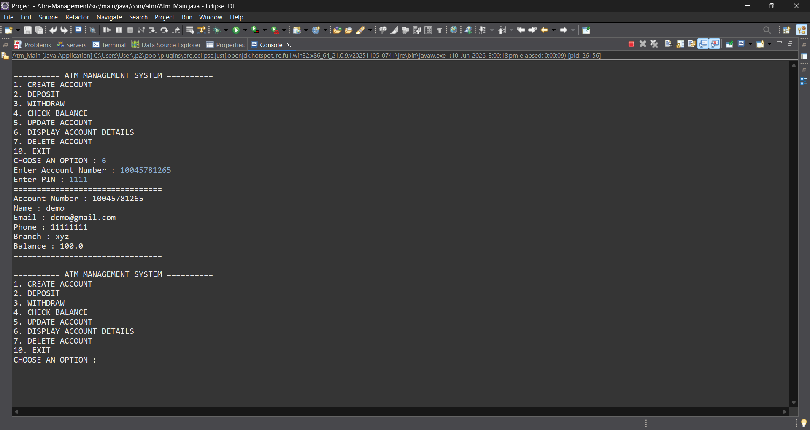
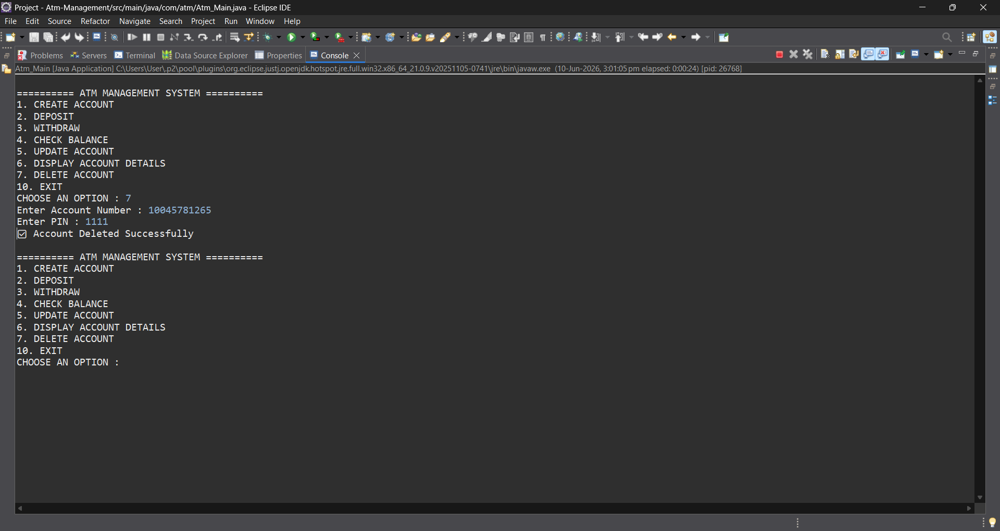

# 🏧 ATM Management System

## 🚀 Project Overview

ATM Management System is a Console-Based Banking Application developed using Core Java, JDBC, and MySQL.

The application simulates real-world ATM operations such as account creation, deposits, withdrawals, balance inquiry, account updates, and account deletion.

The system connects to a MySQL database using JDBC and performs CRUD operations securely through Prepared Statements.

---

## 🎯 Project Objectives

* Automate banking transactions
* Manage customer accounts efficiently
* Perform secure deposits and withdrawals
* Store account information in a database
* Demonstrate JDBC connectivity with MySQL
* Apply OOP concepts and exception handling

---

## ✨ Features

### Account Management

* Create Account
* Display Account Details
* Update Account Information
* Delete Account

### Banking Operations

* Deposit Amount
* Withdraw Amount
* Check Balance

### Security

* PIN Verification
* Account Authentication

### Exception Handling

* Custom InvalidChoiceException
* Input Validation

---

## 🛠️ Technology Stack

### Programming Language

* Java

### Database

* MySQL

### Connectivity

* JDBC

### Concepts Used

* OOP Concepts
* Interfaces
* Exception Handling
* Collections
* Prepared Statements
* CRUD Operations

---

## 🏗️ Architecture

Application Flow:

Main Class
↓
ATM Interface
↓
ATM Implementation
↓
JDBC
↓
MySQL Database

---

## 📂 Project Structure

com.atm

├── Atm_Main.java

├── IAtm.java

├── AtmImplementation.java

├── InvalidChoiceException.java

---

## 🗄️ Database Design

### Account Table

| Column Name    | Data Type |
| -------------- | --------- |
| account_number | VARCHAR   |
| name           | VARCHAR   |
| email          | VARCHAR   |
| phone_number   | VARCHAR   |
| branch         | VARCHAR   |
| pin            | INT       |
| balance        | DOUBLE    |

---

## 🔄 Application Workflow

Start Application
↓
Display ATM Menu
↓
Select Operation
↓
Validate Account & PIN
↓
Perform Transaction
↓
Update Database
↓
Display Result

---

## 📋 Menu Options

1. Create Account
2. Deposit Amount
3. Withdraw Amount
4. Check Balance
5. Update Account
6. Display Account Details
7. Delete Account
8. Exit

---

## 📸 Screenshots

### Main Menu

### Create Account

### Deposit Amount

### Withdraw Amount

### Check Balance

### Update Account

### Display Account Details

### Delete Account

---

## 🎓 Concepts Learned

Through this project, I gained practical experience in:

* Core Java
* JDBC
* MySQL Database Connectivity
* CRUD Operations
* Prepared Statements
* Exception Handling
* Interfaces
* Object-Oriented Programming
* Database Design
* Console Application Development

---

## 🔮 Future Enhancements

* GUI using Java Swing
* Spring Boot Migration
* User Authentication
* Transaction History
* Mini Statement
* Fund Transfer
* Internet Banking Features
* REST API Integration

---

## 👨‍💻 Developer

Gunaseelan Murugesan

Java Full Stack Developer

📧 [gunaseelan05221@gmail.com](mailto:gunaseelan05221@gmail.com)

📱 7418708712

📍 Dindigul, Tamil Nadu, India
